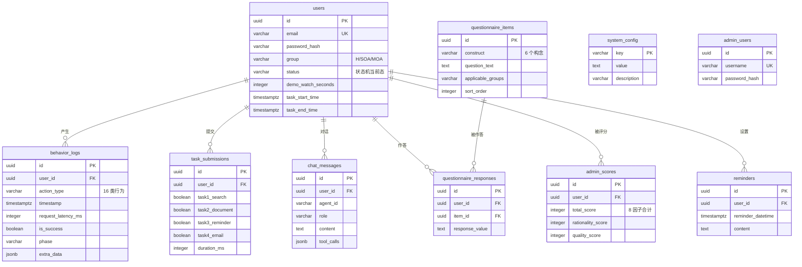
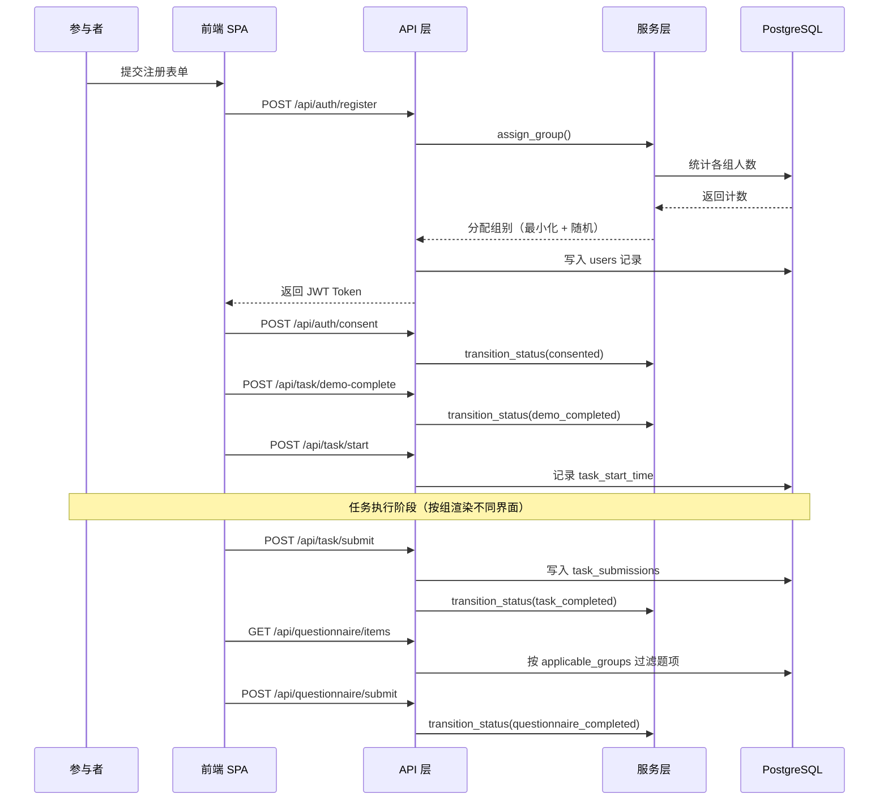

# 人机协作决策实验平台 — 系统架构设计文档

| 项目 | 内容 |
| --- | --- |
| 系统名称 | 人机协作决策实验平台（Travel Experiment Platform） |
| 文档版本 | v1.0 |
| 编制日期 | 2026-07-31 |
| 代码路径 | `D:\27475\WorkBuddy-搭建网站\travel-experiment-platform` |
| 文档性质 | 基于现有源码逆向梳理的架构说明，非需求规格书 |

---

## 一、系统定位与设计目标

本系统是一套用于**人机协作决策研究**的在线实验平台，通过三组间对照设计，考察不同 AI 辅助模式对用户完成复杂决策任务时的行为表现与主观感受的影响。

### 1.1 实验设计映射

| 实验组 | 代号 | 系统实现 | 自变量水平 |
| --- | --- | --- | --- |
| 纯人工组 | `H` | 仅提供搜索、编辑器、提醒、邮件四项基础工具 | 无 AI 辅助 |
| 单智能体组 | `H+SOA` | 在基础工具之外提供 1 个全能 AI 助理 | 单一 AI 辅助 |
| 多智能体组 | `H+MOA` | 在基础工具之外提供 2 个职能分工的 AI 助理 | 多 AI 协同辅助 |

统一实验任务为"杭州 3 日游规划，预算 1000 元"，包含景点搜索、行程文档生成、出行提醒设置、行程邮件发送四项子任务。

### 1.2 架构设计目标

系统架构围绕四个目标构建，这些目标共同约束了后续的技术选型：

1. **实验内部效度优先。** 除自变量（AI 辅助模式）之外，三组的页面骨架、交互流程、埋点逻辑必须完全一致，任何组间差异都应可追溯到显式的分组判断代码。
2. **行为数据可完整回溯。** 参与者的每一次页面访问、搜索、编辑、AI 交互都需落库，且携带足以支撑后续统计分析的元数据（时延、成败、会话标识、实验阶段）。
3. **外部依赖可降级。** LLM、邮件、搜索三类外部服务在密钥缺失时自动切换为 Mock 实现，保证实验流程可在无网络、无预算的条件下完整演练。
4. **研究者可自助运维。** 分组配额、任务参数、问卷题项、AI 服务开关均通过管理后台在线调整，无需改动代码或重启服务。

---

## 二、总体架构

### 2.1 分层结构

系统采用**四层单向依赖**架构，上层仅可调用下层，同层模块之间不产生横向依赖。

```
┌──────────────────────────────────────────────────────────┐
│  前端层  React 18 + TypeScript + Vite + Tailwind CSS      │
│  参与者页面 7 · 管理后台 8 · Zustand Stores 4 · Hooks 3    │
└──────────────────────────────────────────────────────────┘
                  ↓  REST + SSE · JWT Bearer
┌──────────────────────────────────────────────────────────┐
│  API 层  FastAPI Router × 10                              │
│  auth · task · search · document · reminder · email       │
│  agent · questionnaire · log · admin                      │
└──────────────────────────────────────────────────────────┘
                  ↓  Depends 依赖注入
┌──────────────────────────────────────────────────────────┐
│  服务层  业务逻辑与 Agent 框架                              │
│  Agent 框架 · 工具函数 · 实验服务 · 能力服务                 │
└──────────────────────────────────────────────────────────┘
                  ↓  async SQLAlchemy ORM
┌──────────────────────────────────────────────────────────┐
│  数据层  PostgreSQL 17 + asyncpg（10 张表）                │
└──────────────────────────────────────────────────────────┘
                  ⋯  服务层横向调用
┌──────────────────────────────────────────────────────────┐
│  外部依赖  LLM API · 邮件服务 · 搜索服务（均支持 Mock 降级）  │
└──────────────────────────────────────────────────────────┘
```

### 2.2 技术选型与理由

| 层次 | 技术 | 选型理由 |
| --- | --- | --- |
| 前端框架 | React 18 + TypeScript | 组件化便于三组共用同一页面骨架；类型系统降低埋点字段拼写错误风险 |
| 状态管理 | Zustand | 相比 Redux 样板代码少；按领域拆分为 4 个独立 store，避免全局状态耦合 |
| 构建工具 | Vite | 开发期热更新快；生产构建产物直接由后端静态托管 |
| 后端框架 | FastAPI | 原生 async 支持，契合 SSE 流式推送场景；自动生成 OpenAPI 文档便于联调 |
| ORM | SQLAlchemy 2.0 + asyncpg | 全异步驱动避免 AI 长请求阻塞事件循环；声明式模型与类型注解集成度高 |
| 数据库 | PostgreSQL 17 | `JSONB` 字段承载不定结构的埋点扩展数据；事务保证提交与状态流转的原子性 |
| 实时通信 | SSE | 相比 WebSocket 更轻量；本场景仅需服务端→客户端单向推送，无需双工 |
| 认证 | JWT（python-jose） | 无状态便于横向扩展；参与者与管理员双 Token 体系通过 `role` claim 区分 |
| 文档生成 | python-docx | 服务端程序化生成 `.docx`，避免依赖客户端 Office 环境 |

---

## 三、核心模块说明

### 3.1 前端层

#### 3.1.1 页面模块

**参与者流程页（7 个）** — 严格对应实验状态机的各个阶段：

| 页面 | 路径 | 职责 |
| --- | --- | --- |
| `Register` | `/register` | 邮箱密码注册与登录，注册即触发后端分组 |
| `Consent` | `/consent` | 知情同意书签署 |
| `Demo` | `/demo` | 任务演示视频播放，记录观看时长 |
| `Task` | `/task` | **核心页面**，按分组渲染不同工具面板 |
| `Questionnaire` | `/questionnaire` | 量表作答，题项按分组过滤 |
| `Complete` | `/complete` | 实验结束致谢 |
| `ItineraryBoard` | `/itinerary` | 行程看板（独立预览页，拖拽式行程编排） |

**管理后台页（8 个）** — 覆盖实验监控、数据管理与配置：

`AdminLogin` 登录 · `AdminLayout` 布局框架 · `AdminDashboard` 数据看板 · `AdminParticipants` 参与者管理 · `AdminSubmissions` 提交物与评分 · `AdminQuestionnaire` 问卷配置 · `AdminLogs` 行为日志查询 · `AdminSettings` 系统配置

#### 3.1.2 状态管理（Zustand Stores）

| Store | 管理的状态域 |
| --- | --- |
| `userStore` | 参与者身份、JWT Token、任务配置、任务状态 |
| `chatStore` | 按 `agent_id` 分键存储的消息列表、流式状态、工具活动记录 |
| `boardStore` | 行程看板的待选项、分日安排、备注 |
| `adminStore` | 管理员 Token、看板统计、参与者列表、系统配置 |

`chatStore` 采用 `Record<agentId, T>` 的分键结构，这是支撑 MOA 组多助理并行会话的关键设计——每个助理拥有独立的消息历史与流式状态，互不干扰。

#### 3.1.3 自定义 Hooks

| Hook | 职责 |
| --- | --- |
| `useBehaviorLogger` | 行为日志采集，模块级单例队列 + 定时批量上报 |
| `useAgentChat` | 封装 SSE 对话，处理五类事件并同步至 `chatStore` |
| `useTimer` | 任务计时 |

### 3.2 API 层

10 个 Router 按职责划分为四组：

| 分组 | Router | 关键端点 |
| --- | --- | --- |
| 流程控制 | `auth` `task` | 注册/登录/同意/状态查询、任务配置/开始/提交 |
| 能力供给 | `search` `document` `reminder` `email` | 景点搜索、文档生成与下载、提醒设置、邮件发送 |
| AI 对话 | `agent` | SSE 流式对话（唯一的流式端点） |
| 研究支撑 | `questionnaire` `log` `admin` | 问卷题项与作答、日志批量上报、后台管理与导出 |

**依赖注入设计**：`deps.py` 提供 `get_current_user` 与 `get_current_admin` 两个守卫。二者均解析 JWT，但后者额外校验 `payload["role"] == "admin"`，实现参与者与管理员的权限隔离。

### 3.3 服务层

#### 3.3.1 实验服务

**`group_service` — 分组分配。** 注册时调用，逻辑为：统计各组当前人数 → 依据 `target_sample_size` 计算每组配额 → 筛选未满额的组 → 在人数最少的组中随机选取。这一策略保证了任意时刻三组人数差不超过 1，等价于动态最小化分配（minimization），能够在样本量未达标时也维持接近 1:1:1 的平衡。

**`state_machine` — 状态流转。** 通过 `VALID_TRANSITIONS` 字典定义合法的单向状态迁移：

```
registered → consented → demo_completed → task_in_progress
           → task_completed → questionnaire_completed
```

任何跨阶段跳转或回退都会抛出异常，从服务端杜绝参与者跳过实验环节的可能。前端 `RequireAuth` 路由守卫做了同构的二次校验，但服务端校验才是权威约束。

**`seed_service` — 初始数据播种。** 应用启动时幂等地写入默认管理员、8 项系统配置、15 道问卷题项。采用"存在即跳过"策略，不会覆盖研究者的在线修改。

#### 3.3.2 能力服务

| 服务 | 实现要点 | 降级策略 |
| --- | --- | --- |
| `document_service` | 基于 python-docx，内置 HTML→docx 转换器，支持标题、段落、列表、加粗斜体下划线、表格 | 无需降级 |
| `email_service` | 调用 Resend API，支持 base64 附件 | 无密钥时返回 `mock_sent` |
| `search_service` | 抓取 DuckDuckGo HTML，Bing 作为兜底，用标准库 `html.parser` 解析 | 抓取失败时回退内置结果集 |
| `auth_service` | bcrypt 密码哈希 + JWT 签发校验 | 无需降级 |

### 3.4 Agent 框架（核心模块）

Agent 框架是本系统技术复杂度最高的部分，由四个文件构成，采用**工厂模式 + 策略模式**的组合。

#### 3.4.1 模块构成

```
services/agents/
├── llm_client.py        LLM 客户端：MockLLMClient / RealLLMClient + 工厂函数
├── base_agent.py        Agent 基类：对话循环与 Function Calling 编排
├── agent_factory.py     Agent 工厂：系统提示词与工具子集的装配
└── tools/
    └── agent_tools.py   工具函数：定义、实现与分发
```

#### 3.4.2 双客户端设计

`get_llm_client()` 依据 `settings.use_mock_llm`（即 `LLM_API_KEY` 是否为空）返回不同实现：

- **`MockLLMClient`** — 基于关键词匹配模拟工具调用决策，内置 0.5 秒延迟模拟真实时延。使得整套实验流程在零成本、零网络依赖的条件下可完整走通，对预实验和演示极为有用。
- **`RealLLMClient`** — 通过 OpenAI 兼容协议调用真实模型，异常时抛出携带上游响应体的 `RuntimeError`，便于定位密钥失效或额度耗尽。

两者暴露完全一致的 `chat(messages, tools) -> dict` 接口，上层 `BaseAgent` 对具体实现无感知。

#### 3.4.3 Agent 装配

`AGENT_CONFIGS` 定义了三个 Agent 实例的差异，**唯一的区别在于系统提示词与工具子集**，共用同一个 `BaseAgent` 类：

| Agent ID | 角色 | 可用工具 | 所属组 |
| --- | --- | --- | --- |
| `soa` | 全能旅行规划助理 | 全部 5 个工具 | H+SOA |
| `moa_a` | 信息检索专员 | `search_attractions` | H+MOA |
| `moa_b` | 行程编排专员 | `generate_docx`、`calculate_budget` | H+MOA |

所有 Agent 共享一份 `OUTPUT_FORMAT_SPEC` 输出格式规范，强制 Markdown 分板块结构，确保三组看到的 AI 回复在**形式上**具有可比性，排除排版差异对主观评价的干扰。

**MOA 的协作模式为"用户中介式"**：两个 Agent 之间不存在自动通信通道，信息传递完全依赖参与者手动复制转述。这是刻意的设计选择——它使得"多智能体协同"的认知负荷真实地落在参与者身上，符合研究对人机协作模式的操作化定义。

#### 3.4.4 工具层

五个工具函数通过 `TOOL_DEFINITIONS`（JSON Schema 描述）暴露给 LLM，通过 `TOOL_EXECUTORS` 字典分发执行：

| 工具 | 功能 | 底层依赖 |
| --- | --- | --- |
| `search_attractions` | 景点信息检索 | 内置结果集 |
| `generate_docx` | 生成行程 Word 文档 | `document_service` |
| `calculate_budget` | 预算测算与超支提示 | 纯计算 |
| `set_reminder` | 出行提醒设置 | 返回结构化结果 |
| `send_email` | 行程邮件发送 | `email_service` |

`execute_tool` 统一捕获异常并以 `{"error": ...}` 形式返回，保证单个工具失败不会中断整个对话流。

### 3.5 数据层

采用 async SQLAlchemy 2.0 声明式模型，`get_db` 依赖提供带自动提交/回滚的会话：请求正常结束则 `commit`，抛出异常则 `rollback`。连接池配置为 `pool_size=10, max_overflow=20`。

> **注**：`init_db()` 当前使用 `Base.metadata.create_all` 建表，适用于开发环境；`database/` 目录下已提供 `schema.sql` 与三个增量迁移脚本供生产部署使用。

---

## 四、数据模型

### 4.1 实体关系



### 4.2 关键表设计说明

#### 4.2.1 `users` — 被试主表

`group` 与 `status` 两个字段承载了全部实验控制逻辑。需注意 `group` 是 PostgreSQL 保留字，在 DDL 中必须加双引号，ORM 侧通过 `mapped_column(..., name="group")` 显式映射。

人口统计学字段（`age`、`gender`、`education`、`tech_frequency`、`ai_experience`）保留为可空列，当前注册流程不采集，改由登录后的 `POST /auth/demographics` 独立提交。

#### 4.2.2 `behavior_logs` — 行为日志表（研究数据核心）

这是全系统字段最丰富的表，共 16 类行为类型：

| 类别 | 行为类型 |
| --- | --- |
| 导航 | `page_view`、`demo_view` |
| 检索 | `search_query`、`search_result_click` |
| 文档 | `document_edit`、`document_save`、`document_download` |
| 事务 | `reminder_set`、`reminder_cancel`、`email_send` |
| AI 交互 | `agent_message`、`agent_tool_call` |
| 任务 | `task_start`、`task_submit`、`checklist_toggle` |
| 问卷 | `questionnaire_submit` |

除基础字段外，表中包含一组**研究导向的富化字段**，直接对应后续统计分析所需的因变量：

| 字段组 | 字段 | 分析用途 |
| --- | --- | --- |
| 性能指标 | `request_latency_ms`、`is_success`、`error_detail` | 系统响应性能、任务成功率 |
| 会话元数据 | `user_agent`、`screen_resolution`、`session_start_time`、`experiment_version` | 设备异质性控制、版本追溯 |
| 任务过程 | `phase`、`manual_edit_count`、`final_plan_submit_time` | 人工投入度、阶段耗时 |
| 检索行为 | `results_viewed`、`result_view_duration_ms`、`clicked_item_id` | 信息搜寻深度 |
| AI 采纳 | `user_action_on_ai`、`ai_suggestion_id`、`ai_suggestion_type`、`ai_interaction_rounds` | **AI 建议采纳率、依赖程度** |

其中 `user_action_on_ai`（取值 `accept`/`reject`/`modify`）是衡量算法依赖与人类自主性的关键指标。

#### 4.2.3 `questionnaire_items` — 问卷题项表

题项支持在线配置，覆盖 6 个研究构念：感知信任、感知自主性、满意度、任务负荷（NASA-TLX）、未来使用意愿、操纵检验。

`applicable_groups` 字段实现了**单盲设计的题面适配**：H 组题目表述为"本工具/方法"，SOA/MOA 组表述为"AI 助理"，取值为 `"ALL"` / `"H"` / `"SOA,MOA"`。这样既保证了构念测量的一致性，又避免向 H 组参与者泄露实验中存在 AI 条件。

#### 4.2.4 `admin_scores` — 行程质量评分表

依据 GB/T 18972-2017 派生的 8 因子百分制评分方案：观赏游憩价值、历史文化价值、珍稀奇特程度、规模丰度、完整性、知名度、适游期、环境保护。另设 `rationality_score`（行程合理性）与 `quality_score`（整体质量）两个总体指标。

#### 4.2.5 `system_config` — 系统配置表

以键值对形式存储 8 项可在线调整的实验参数：

| 键 | 默认值 | 说明 |
| --- | --- | --- |
| `destination` | 杭州 | 目的地 |
| `task_days` | 3 | 旅行天数 |
| `task_budget` | 1000 | 预算（元） |
| `target_email` | experiment@example.com | 收件邮箱 |
| `target_sample_size` | 100 | 目标样本量（决定分组配额） |
| `block_size` | 6 | 区组大小 |
| `experiment_active` | true | 实验总开关 |
| `agent_service_paused` | false | **AI 助理服务暂停开关** |

`agent_service_paused` 是实验中断机制的实现载体，研究者可在观察到异常时一键暂停全部 AI 服务，被拦截的请求返回 403 并记入日志。

---

## 五、核心数据流

### 5.1 参与者实验主流程



每一次状态迁移都经过 `state_machine` 校验，非法流转在服务端被拒绝。

### 5.2 AI 助理对话数据流

这是系统中唯一的流式链路，共五个阶段：

**阶段 1 · 前端发起。** `ChatWindow` 组件收集输入，`useAgentChat` Hook 记录起始时间戳，通过 `fetch` 发起 POST 请求并以 `ReadableStream` 逐块读取响应。

**阶段 2 · 准入校验。** `agent` router 执行双重校验：
- 用户组别必须为 SOA 或 MOA，否则 403；
- 查询 `system_config` 中的 `agent_service_paused`，若为 `true` 则 403；
- 校验 `agent_id` 与组别的匹配关系（SOA 组仅可用 `soa`，MOA 组仅可用 `moa_a`/`moa_b`）。

**阶段 3 · Agent 装配与首轮推理。** `get_agent(agent_id)` 从 `AGENT_CONFIGS` 取出提示词与工具子集构造 `BaseAgent`。`BaseAgent.chat()` 先将用户消息落库并 `flush`，再加载该用户与该 Agent 的最近 10 条历史消息拼装上下文，随后调用 LLM。

**阶段 4 · 工具执行与二轮推理。** 若 LLM 返回 `tool_calls`，则依次：推送 `tool_call` 事件 → `execute_tool` 分发执行 → 推送 `tool_result` 事件 → 将结果回灌消息列表。全部工具执行完毕后发起第二轮 LLM 调用，由模型基于工具结果生成最终答复。

**阶段 5 · 流式回传与落库。** 最终文本经 `re.findall(r"\S+|\s+", content)` 切分为词元与空白符两类 token 后逐个推送。这一分词策略的用意是**保留 Markdown 的换行与段落结构**——若按字符或按空格切分，`\n\n` 段落分隔会丢失导致渲染错乱。推送完毕后写入 `chat_messages`，并在 `finally` 块中无条件写入一条 `agent_message` 行为日志（含时延、成败、错误详情）。

**SSE 事件契约：**

| 事件 | 数据结构 | 前端处理 |
| --- | --- | --- |
| `status` | `{status, agent_id}` | 显示思考中状态 |
| `tool_call` | `{tool, arguments}` | 写入 `ExecutionLog` 可视化面板 |
| `tool_result` | `{tool, result}` | 追加执行结果 |
| `content` | `string`（token） | 累加并原地更新同一条消息气泡 |
| `done` | `{status}` | 关闭流式状态 |
| `error` | `{error}` | 展示错误并终止 |

前端 `updateAssistantContent` 采用**原地更新**而非追加新消息，避免流式过程中产生多个气泡。

### 5.3 行为日志采集流

日志采集采用**模块级单例队列 + 双重触发上报**的设计：

```
用户操作
  ↓
useBehaviorLogger.log() / logAgent() / logSearch() / logPlanEdit() / logPlanSubmit()
  ↓
自动注入 SESSION_META（user_agent、screen_resolution、session_start_time、experiment_version）
  ↓
推入模块级 queue
  ↓
触发条件：① 定时器每 5 秒  ② 队列达到 50 条
  ↓
POST /api/log/batch（批量）
  ↓
成功 → 清空批次
失败 → 回滚队列 + 写入 localStorage（最多保留 200 条）
```

**三点设计考量：**

1. **单例队列而非组件级状态。** 队列与定时器定义在模块作用域，保证整个标签页只有一个上报通道，避免多组件同时挂载 Hook 导致重复上报或定时器泄漏。
2. **语义化辅助方法。** 除通用 `log()` 外，提供 `logAgent`、`logSearch`、`logPlanEdit`、`logPlanSubmit` 四个语义方法，将字段填充逻辑收敛在 Hook 内部，避免各页面各自拼装导致字段缺失。
3. **失败降级到 localStorage。** 网络异常时日志不丢弃，落入本地存储等待后续恢复。这对实验数据完整性至关重要——参与者的一次网络抖动不应造成整段行为轨迹缺失。

同时，服务端在关键动作（如 Agent 对话）中**独立写入日志**，与前端埋点形成互补。前端日志覆盖交互细节，服务端日志保证关键事件不因客户端异常而丢失。

### 5.4 数据导出流

管理后台提供五个导出端点，支撑后续统计分析：

| 端点 | 内容 | 格式 |
| --- | --- | --- |
| `/admin/export/participants` | 参与者名单与分组 | CSV |
| `/admin/export/logs` | 全量行为日志 | CSV |
| `/admin/export/scores` | 行程质量评分 | CSV |
| `/admin/export/all` | 全量数据打包 | CSV |
| `/admin/export/all/xlsx` | 全量数据多工作表 | XLSX |

---

## 六、关键设计决策

### 决策 1：SSE 而非 WebSocket

**背景**：AI 对话需要将生成内容实时推送给前端。

**决策**：采用 SSE（Server-Sent Events）。

**理由**：本场景的数据流严格单向——用户消息通过普通 POST 提交，只有 AI 回复需要流式推送。WebSocket 的双工能力在此处是多余复杂度，且需额外处理心跳、重连、连接状态管理。SSE 基于 HTTP，天然复用现有的 JWT 认证与 CORS 配置，代理层无需特殊处理（已在响应头设置 `X-Accel-Buffering: no` 以禁用 Nginx 缓冲）。

### 决策 2：Mock/Real 双客户端工厂

**背景**：LLM API 调用有成本，且预实验、演示、单元测试场景不需要真实模型。

**决策**：`get_llm_client()` 依据密钥是否配置自动返回 Mock 或 Real 实现。

**理由**：将"是否使用真实模型"从代码分支降级为环境变量配置，使得同一份代码可无缝切换。Mock 实现通过关键词匹配模拟工具调用决策，能够走通完整的 Function Calling 链路（包括 `tool_call`/`tool_result` 事件推送），因此前端与日志逻辑无需为 Mock 场景做任何特殊处理。同样的降级策略也应用于邮件服务与搜索服务。

### 决策 3：单一 `BaseAgent` 类 + 配置化差异

**背景**：需要实现 SOA 与 MOA 两种模式共三个 Agent。

**决策**：不做继承派生，三个 Agent 共用 `BaseAgent`，差异全部外置到 `AGENT_CONFIGS` 字典。

**理由**：从实验方法学角度，三个 Agent 的**对话循环逻辑必须完全一致**，否则组间差异将无法归因于自变量。若采用子类继承，任何子类对 `chat()` 的覆写都可能引入非预期的行为差异。配置化方案将差异严格限制在"系统提示词"与"工具子集"两个维度，这正是实验操作化定义所要求的。

### 决策 4：MOA 组不实现 Agent 间自动通信

**背景**：多智能体系统的常见实现是 Agent 之间自动协商传递。

**决策**：`moa_a` 与 `moa_b` 完全独立，信息传递由参与者手动完成。

**理由**：本研究考察的是**人机协作**而非**多智能体自动化**。若 Agent 之间自动串联，参与者将退化为旁观者，无法观测到"人在多智能体环境中如何分配任务、整合信息"这一核心研究问题。手动中介的设计使得协调成本真实落在参与者身上，从而可通过行为日志测量其认知负荷。

### 决策 5：分组信息不参与前端路由决策

**背景**：需要按组渲染不同的任务界面，同时维持单盲。

**决策**：分组仅影响 `Task` 页面内部的面板渲染，不影响路由结构；问卷题面按组适配以避免措辞泄露。

**理由**：三组共用完全相同的 URL 路径与页面骨架，参与者无法通过 URL、页面标题或导航结构推断自己所在的组。配合问卷 `applicable_groups` 的题面改写，H 组参与者在整个实验过程中不会接触到"AI 助理"这一表述。

---

## 七、实验方法学保障机制

架构中有若干设计专门服务于研究效度，在此集中说明：

| 机制 | 实现位置 | 保障的效度维度 |
| --- | --- | --- |
| 动态最小化分组 | `group_service.assign_group` | 组间可比性，防止分配不均 |
| 服务端状态机 | `state_machine.VALID_TRANSITIONS` | 流程标准化，防止跳步 |
| 统一输出格式规范 | `agent_factory.OUTPUT_FORMAT_SPEC` | 排除排版差异的干扰 |
| 问卷题面按组适配 | `questionnaire_items.applicable_groups` | 单盲，防止条件泄露 |
| 操纵检验题项 | 问卷 `manipulation_check` 构念 | 验证被试确实感知到了实验操纵 |
| 双通道日志采集 | 前端 Hook + 服务端 router | 数据完整性 |
| AI 服务暂停开关 | `system_config.agent_service_paused` | 异常情况下的实验中断能力 |
| 时延与成败记录 | `behavior_logs` 富化字段 | 控制技术性能对主观评价的混淆 |

---

## 八、已识别的架构风险与改进建议

以下问题基于源码审查发现，按影响程度排序。**这些不是当前系统的故障，而是在特定条件下会显现的风险点。**

### 8.1 高优先级

#### 风险 1：切换真实 LLM 时工具调用协议可能不合规

`base_agent.py` 在回灌工具结果时构造的消息为：

```python
messages.append({"role": "assistant", "content": llm_response.get("content", "")})
messages.append({"role": "tool", "content": json.dumps(tool_result, ...)})
```

OpenAI 兼容协议要求 `role="tool"` 的消息必须携带 `tool_call_id`，且前置的 assistant 消息需包含 `tool_calls` 字段。当前实现两者均缺失。由于目前默认走 Mock 客户端，该问题尚未暴露；一旦配置真实密钥并触发工具调用，第二轮请求很可能返回 400。

**建议**：在回灌时补全 `tool_call_id`（取自 `tc["id"]`）与 assistant 消息的 `tool_calls` 字段。此项应在正式实验前完成验证。

#### 风险 2：分组信息通过 JWT 载荷暴露给客户端

`Task.tsx` 第 121 行直接解码 JWT payload 读取 `group` 字段以决定界面渲染。JWT 的 payload 部分仅为 Base64 编码而非加密，具备基本技术能力的参与者可自行解码得知自己的分组。

**建议**：改由服务端下发**能力标志**（如 `{"has_ai": true, "agent_ids": ["moa_a","moa_b"]}`）替代原始组名，前端依据能力标志渲染。这样即便被解码，暴露的也只是"当前界面有哪些工具"这一参与者本就可见的信息，而非实验分组标签。

### 8.2 中优先级

#### 风险 3：工具调用固定两轮，无法链式编排

当前实现为"首轮 LLM → 执行工具 → 二轮 LLM → 结束"的固定结构，第二轮调用时未传入 `tools` 参数，因此模型无法再次发起工具调用。这意味着"先搜索景点、再据此生成文档"这类需要串联两个工具的复合指令无法一次完成。

**建议**：改为 `while` 循环，设置最大轮次上限（建议 5 轮）并在每轮传入工具定义。若出于实验控制考虑有意限制为单轮工具调用，建议在文档中显式说明这是设计约束而非实现遗漏。

#### 风险 4：对话历史重放丢失工具上下文

历史加载仅取出 `role` 与 `content` 两个字段，`tool_calls` 虽已存入 JSONB 但未参与重放。多轮对话中模型无法感知此前调用过哪些工具、得到过什么结果，可能重复执行相同操作。

**建议**：重放时一并还原 `tool_calls`，或在 `content` 中以文本形式摘要历史工具执行结果。

#### 风险 5：Agent 工具未复用真实搜索服务

`search_service.py` 已实现基于 DuckDuckGo/Bing 的真实检索，但 `agent_tools.search_attractions` 仍从 `routers.search.MOCK_RESULTS` 取数。结果是：H 组通过搜索框拿到的是真实结果，SOA/MOA 组通过 AI 拿到的是内置结果集。

**这会构成组间的信息源差异，是需要优先关注的效度威胁。**

**建议**：将 `search_attractions` 改为调用 `search_service`，与 H 组的搜索路径保持一致。若因稳定性考虑需固定结果集，则应同时将 H 组的搜索也切换为同一结果集，保证三组信息源同质。

#### 风险 6：流式输出为伪流式

`BaseAgent` 先等待 LLM 完整返回，再将文本切分推送。参与者感知到的"打字机效果"实际发生在内容已全部生成之后，首字节时延等于完整生成时延。

**建议**：若追求真实流式体验，需改用 LLM 的 `stream=True` 模式逐块转发。但需注意：**这会改变 AI 响应的时间特征，属于实验条件的变更**，若在数据收集中途切换将影响组内一致性，建议在正式实验开始前定稿。

### 8.3 低优先级

| 风险 | 说明 | 建议 |
| --- | --- | --- |
| 建表方式 | `create_all` 不追踪 schema 变更，`alembic` 已在依赖中但未启用 | 生产部署改用 Alembic 迁移 |
| 文档注释偏差 | `group_service` 注释称"区组大小 6 的区组随机化"，实际为动态最小化分配 | 更正注释，或在论文方法部分按实际算法描述 |
| 日志端点无限流 | `/api/log/batch` 未做速率限制 | 增加基于用户的速率限制 |
| MOA 组 Agent 数量 | 早期需求文档记载 3 个 Agent，当前实现为 2 个 | 确认是否需补充第三个「事务处理专员」，或同步更新需求文档 |
| 默认凭据 | `admin/admin123` 与默认 `SECRET_KEY` 硬编码于配置默认值 | 生产部署前通过环境变量覆盖 |

---

## 九、附录

### 9.1 完整 API 清单

**认证 `/api/auth`**

| 方法 | 路径 | 说明 |
| --- | --- | --- |
| POST | `/register` | 注册并分配组别 |
| POST | `/login` | 参与者登录 |
| POST | `/consent` | 签署知情同意 |
| POST | `/demographics` | 提交人口统计信息 |
| GET | `/me` | 获取当前用户信息 |
| POST | `/admin/login` | 管理员登录 |

**任务 `/api/task`**

| 方法 | 路径 | 说明 |
| --- | --- | --- |
| GET | `/config` | 获取任务参数（目的地、天数、预算） |
| POST | `/demo-complete` | 标记演示完成 |
| POST | `/start` | 开始任务 |
| POST | `/submit` | 提交任务 |
| GET | `/status` | 查询任务状态 |

**能力端点**

| 方法 | 路径 | 说明 |
| --- | --- | --- |
| POST | `/api/search` | 景点搜索 |
| POST | `/api/document/generate` | 生成 Word 文档 |
| GET | `/api/document/download/{file_name}` | 下载文档 |
| POST | `/api/reminder` | 设置提醒 |
| GET | `/api/reminder` | 查询提醒列表 |
| POST | `/api/email/send` | 发送邮件 |
| POST | `/api/agent/chat` | **SSE 流式对话** |

**问卷与日志**

| 方法 | 路径 | 说明 |
| --- | --- | --- |
| GET | `/api/questionnaire/items` | 获取题项（按组过滤） |
| POST | `/api/questionnaire/submit` | 提交作答 |
| POST | `/api/log/batch` | 批量上报行为日志 |
| GET | `/api/log` | 查询日志 |

**管理后台 `/api/admin`**

| 方法 | 路径 | 说明 |
| --- | --- | --- |
| GET | `/dashboard` | 看板统计 |
| GET | `/openclaw/status` | AI 服务状态 |
| POST | `/openclaw/toggle` | 暂停/恢复 AI 服务 |
| GET | `/logs` | 行为日志查询 |
| GET | `/participants` | 参与者列表 |
| GET | `/participants/{user_id}` | 参与者详情 |
| PATCH | `/participants/{user_id}` | 修改参与者 |
| GET | `/submissions` | 提交物列表 |
| POST | `/scores/{user_id}` | 录入评分 |
| GET / PUT | `/config` | 系统配置读写 |
| GET | `/questionnaire-config` | 问卷配置 |
| GET | `/export/participants` | 导出参与者 CSV |
| GET | `/export/logs` | 导出日志 CSV |
| GET | `/export/scores` | 导出评分 CSV |
| GET | `/export/all` | 导出全量 CSV |
| GET | `/export/all/xlsx` | 导出全量 XLSX |

**健康检查**：`GET /api/health`

### 9.2 目录结构

```
travel-experiment-platform/
├── frontend/
│   └── src/
│       ├── pages/              7 个参与者页面
│       │   └── admin/          8 个管理后台页面
│       ├── components/         ChatWindow · ExecutionLog
│       ├── stores/             user · chat · board · admin
│       ├── hooks/              useAgentChat · useBehaviorLogger · useTimer
│       ├── services/           api.ts（axios 实例）· index.ts（端点封装）
│       └── types/              TypeScript 类型定义
├── backend/
│   └── app/
│       ├── main.py             应用入口、CORS、路由注册、全局异常处理
│       ├── config.py           Pydantic Settings 配置
│       ├── database.py         异步引擎与会话工厂
│       ├── deps.py             JWT 依赖注入守卫
│       ├── models/             10 个 ORM 模型
│       ├── routers/            10 个 API 路由
│       ├── schemas/            Pydantic 请求/响应模型
│       └── services/
│           ├── agents/         Agent 框架
│           │   ├── llm_client.py
│           │   ├── base_agent.py
│           │   ├── agent_factory.py
│           │   └── tools/agent_tools.py
│           ├── auth_service.py
│           ├── group_service.py
│           ├── state_machine.py
│           ├── document_service.py
│           ├── email_service.py
│           ├── search_service.py
│           └── seed_service.py
├── database/
│   ├── schema.sql              建表脚本
│   ├── seed.sql                初始数据
│   └── migrate_*.sql           3 个增量迁移脚本
└── docker-compose.yml          PostgreSQL 容器编排
```

---

*本文档基于源码逆向梳理编制，如后续代码变更请同步更新。*
